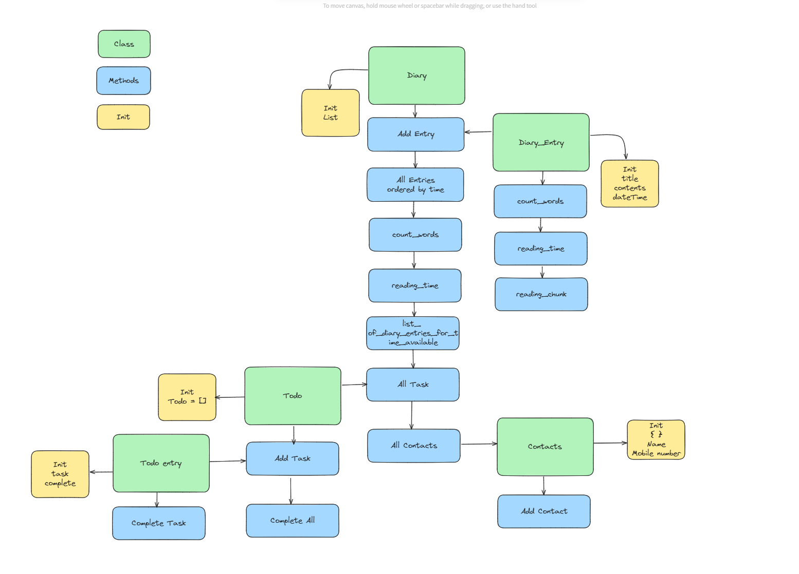

# {{PROBLEM}} Multi-Class Planned Design Recipe

## 1. Describe the Problem

As a user

<!-- So that I can record my experiences
I want to keep a regular diary -->

As a user

<!-- So that I can reflect on my experiences
I want to read my past diary entries -->

As a user

<!-- So that I can reflect on my experiences in my busy day
I want to select diary entries to read based on how much time I have and my reading speed -->

As a user

<!-- So that I can keep track of my tasks
I want to keep a todo list along with my diary -->

As a user

<!-- So that I can keep track of my contacts
I want to see a list of all of the mobile phone numbers in all my diary entries -->

## 2. Design the Class System

_Consider diagramming out the classes and their relationships. Take care to
focus on the details you see as important, not everything. The diagram below
uses asciiflow.com but you could also use excalidraw.com, draw.io, or miro.com_

```

```

_Also design the interface of each class in more detail._

```python
class MusicLibrary:
    # User-facing properties:
    #   tracks: list of instances of Track

    def add(self, track):
        # Parameters:
        #   track: an instance of Track
        # Side-effects:
        #   Adds the track to the tracks property of the self object
        pass # No code here yet

    def search_by_title(self, keyword):
        # Parameters:
        #   keyword: string
        # Returns:
        #   A list of the Track objects that have titles that include the keyword
        pass # No code here yet


class Track:
    # User-facing properties:
    #   title: string
    #   artist: string

    def __init__(self, title, artist):
        # Parameters:
        #   title: string
        #   artist: string
        # Side-effects:
        #   Sets the title and artist properties
        pass # No code here yet

    def format(self):
        # Returns:
        #   A string of the form "TITLE by ARTIST"
        pass # No code here yet

class Diary:
    # User-facing properties:
    #   tracks: list of entires and todo and contacts
    def __init__(self):
        pass

    def add_entry(self, entry):
        pass

    def all_entries(self):
        pass

    def read_entry(self, entry):
        pass

    def count_words(self):
        pass

    def reading_time(self, wpm):
        pass

    def list_of_entries_for_reading_time(self, wpm):
        pass

    def all_todos(self, todos):
        pass

    def all_contacts(self, contacts):
        pass

class DiaryEntry:
    # User-facing properties:
    #   title: string
    #   content: string
    #   dateTime
    def __init__(self):
        pass

    def count_words(self):
        pass

    def reading_time(self, wpm):
        pass

    # maybe

    def format_entry(self):
        pass


class Contacts:
    # User-facing properties:
    #   dict
    #   name: string
    #   contact number: string
    def __init__(self):
        pass

    def add_contact(self):
        pass


class Todo:
    # User-facing properties:
    #   list
    def __init__(self):
        pass

    def add_task(self, task):
        pass

    def complete_all(self):
        pass


class TodoEntry:
    # User-facing properties:
    #   task: string
    #   complete: bool
    def __init__(self):
        pass

    def complete_task(self):
        pass
```

## 3. Create Examples as Integration Tests

_Create examples of the classes being used together in different situations and
combinations that reflect the ways in which the system will be used._

```python
# EXAMPLE

"""
Given a library
When we add two tracks
We see those tracks reflected in the tracks list
"""
library = MusicLibrary()
track_1 = Track("Carte Blanche", "Veracocha")
track_2 = Track("Synaesthesia", "The Thrillseekers")
library.add(track_1)
library.add(track_2)
library.tracks # => [track_1, track_2]
```

## 4. Create Examples as Unit Tests

_Create examples, where appropriate, of the behaviour of each relevant class at
a more granular level of detail._

```python
# EXAMPLE

"""
Given a track with a title and an artist
We see the title reflected in the title property
"""
track = Track("Carte Blanche", "Veracocha")
track.title # => "Carte Blanche"
```

_Encode each example as a test. You can add to the above list as you go._

## 5. Implement the Behaviour

_After each test you write, follow the test-driving process of red, green,
refactor to implement the behaviour._
